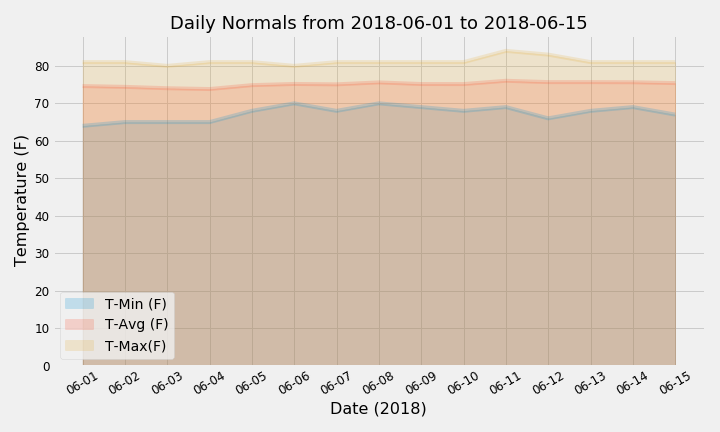
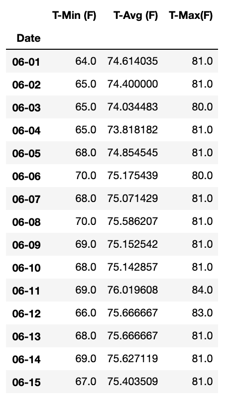

# sqlalchemy-challenge: Surfs Up!

## Background

This assignment involved analysing and exploring Hawaii's climate data in 2 steps: 
**1. Climate Analysis and Exploration** 
**2. Climate App**

## Notes

* All analyses and visualizations, including the bonus challenges, can be found in the Jupyter notebook called `climate-analysis.ipynb`.

* The `Resources` folder contains the `hawaii.sqlite` database file and 2 csv files containing the measurement and station tables.

* The `images` folder contains 4 visualizations from the analysis and bonus challenges.

* The `app.py` file contains the code for a Flask web app to query the climate database.

## Step 1: Climate Analysis and Exploration

Python and SQLAlchemy was used to do basic climate analysis and data exploration of the given climate database. All of the analysis was completed using SQLAlchemy ORM queries, Pandas, and Matplotlib.

### Precipitation Analysis

The datetime library was used to identify the date 12 months prior to the last date available. Using these dates and after dropping 209 null values, the precipitation values for the last year of data was used to plot the following graph:

A statistics summary using `.describe()` revealed the following:
    

### Station Analysis

This section asked to find the number of stations (nine) and the most active station (USC00519281).

Temperature observations at this station for the last 12 months was plotted as a histogram with the following results:

## Step 2: Climate App

This is a web app in the `app.py` file, created using SQLAlchemy and Flask API. The climate database can be queried for the following to receive information in JSON format:

* **Precipitation (/api/v1.0/precipitation)**: This route displays every date and temperature observation across all weather stations in Hawaii.

* **Stations (/api/v1.0/stations)**: This route displays a list of all 9 stations (ID, Station and Name).

* **Temperature Observations (/api/v1.0/tobs)**: This route displays every date and temperature observation for the most active station in Hawaii (USC00519281) in the last 12 months of data available.

* **Daily Normals from start date (/api/v1.0/start_date)**: This route allows you to enter a start date in the format 'YYYY-MM-DD' to retrieve daily normals (TMIN, TAVG, TMAX) from that date onward until the end of data available.

* **Daily Normals between start and end date (/api/v1.0/start_date/end_date)**: This route allows you to enter a start date AND an end date in the format 'YYYY-MM-DD' to retrieve daily normals (TMIN, TAVG, TMAX) for the date range.

## Bonus Challenges

### Temperature Analysis I

June and December temperature observations were retrieved by converting string dates to datetime objects in order to filter queries by month.

Null hypothesis: The mean difference between the temperatures in June and December is zero.

A paired t-test was used as we are comparing the means of the same group i.e. in this case, the mean temperature observations are of the same stations, just for different timepoints. The p-value of 0.0001 is less than 0.05 so we reject the null hypothesis and conclude that the data is statistically significant.

### Temperature Analysis II

This challenge involved using a predefined function that calculated daily normals for a given date range (2018-06-01 to 2018-06-15). The `.timedelta()` method from the datetime library was also used to determine matching start and end dates from the previous year.

With the daily normals, the following graph was plotted using tavg, tmin and tmax values:

### Daily Rainfall Average

In this challenge, the first ask was to calculate the precipitation for each weather station and display the results along with station information. After querying the databases for both tables and checking for null values, the query results were saved in  Pandas dataframes in order to make it easier to manipulate data by using groupby and merge. The following dataframe is the result:

The second part of this challenge involved finding daily normals for each date of our defined trip from 2018-06-01 to 2018-06-15 (using only the month and day to identify historic data with the same dates) and plotting an area plot as below:

Trip daily normals dataframe:

